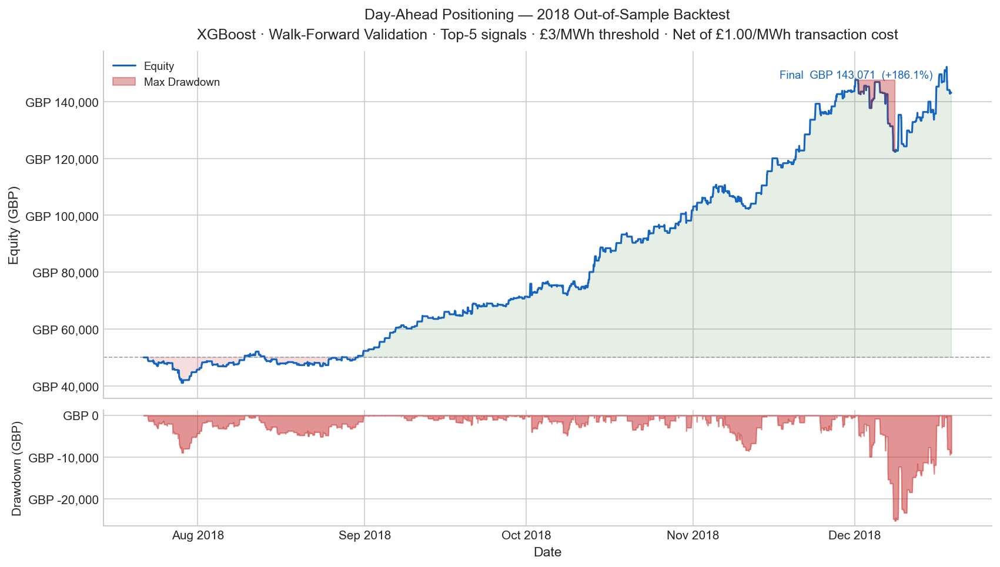

# Day-Ahead Power Positioning

End-to-end quantitative research framework for virtual trading in the GB wholesale electricity market. The system uses machine learning to proxy residual load mispricing against the EPEX Day-Ahead auction price, then schedules high-conviction bids using only pre-auction information.

**2018 validated backtest:** +285.8% return · 3.70 Sharpe · 53.6% win rate 




## How It Works

- Signal is derived from ML-proxied forecast error in residual load 
- Features pinned to the D-1 10:30 pre-auction vintage
- Walk-forward validation on sliding 200-day windows adapts to seasonal regime shifts
- Position sizing scales with equity so drawdowns automatically reduce exposure


```bash
python main.py --config configs/config.yaml                   # full pipeline
python main.py --config configs/config.yaml --mode features   # features only
python main.py --config configs/config.yaml --mode model      # train & backtest
```

## Docs

|---|---|
| [ARCHITECTURE.md](ARCHITECTURE.md) | Strategy design, market rationale, signal logic, feature engineering, performance, and development roadmap |
| [DATA_SOURCES.md](DATA_SOURCES.md) | Seven datasets across three APIs, CSV fallbacks, and per-day caching |
| [DEVELOPMENT.md](DEVELOPMENT.md) | Environment setup, project structure, and VS Code launch configs |

## Research Notebook

`notebooks/01_da_positioning_backtest.ipynb` — Full tournament sweep: model shootout, hyperparameter calibration under walk-forward discipline, execution stress-testing with transaction costs, and a production tear sheet.

## Roadmap

- [x] **Phase 1 — DA Positioning Engine (complete):** End-to-end ML pipeline for virtual trading in the GB Day-Ahead market. Walk-forward validated ensemble of XGBoost, Random Forest, and Linear Regression models predicting residual load mispricing, with signal gating, execution constraints, and dynamic position sizing.
- [ ] **Phase 2 — Intraday Execution:** Replace the DA-to-imbalance settlement assumption with realistic continuous ID market exits. Ingest order book snapshots and MIP data to simulate scaling out of DA positions before gate closure, subjecting the strategy to real bid/ask slippage.
- [ ] **Phase 3 — Physical Asset Optimisation (BESS):** Extend the engine to support battery storage dispatch. Introduce state-of-charge tracking, cycle degradation costs, and MWh capacity constraints to optimise charge/discharge schedules against the DA and ID price curves.

## Acknowledgements

Data is sourced from three open platforms:

- **[ENTSO-E Transparency Platform](https://transparency.entsoe.eu)** — GB Day-Ahead auction prices
- **[Elexon BMRS](https://bmrs.elexon.co.uk)** — Wind forecasts, generation actuals, demand actuals, market index prices, and imbalance settlement prices
- **[NESO CKAN API](https://data.nationalgrideso.com)** — Demand forecasts

Built mainly with XGBoost, scikit-learn, pandas, and NumPy.
