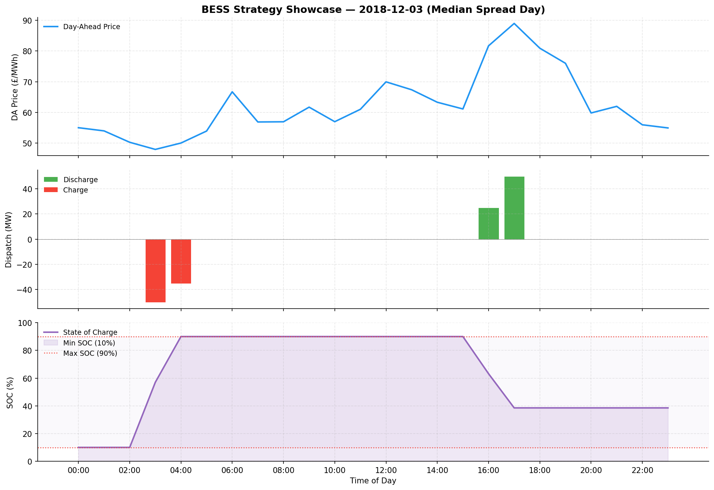

# Day-Ahead Power Trading

End-to-end quantitative research framework for virtual and physical trading in the GB wholesale electricity market.

**Virtual Strategy** — ML-proxied residual load mispricing against the EPEX Day-Ahead auction, with hybrid intraday execution splitting volume between a passive MID hedge and an active TP/SL engine.

**BESS Strategy** — Battery Energy Storage System dispatch optimisation via LP-based Day-Ahead scheduling, an opportunity-cost intraday engine, and ex-post imbalance settlement.

**2018 validated backtest (Virtual):**


**Battery Dispatch in DA market:**



---

## Quick-Start

```bash
# 1. Create and activate the environment
conda create -n quantenv python=3.12 && conda activate quantenv

# 2. Install dependencies
pip install -r requirements.txt

# 3. Configure API keys and experiment settings
cp .env.example .env
cp configs/config.example.yaml configs/config.yaml
# Edit .env with your ENTSO-E API key; edit config.yaml for dates, model params, etc.

# 4. Seed sample data
python bootstrap_data.py

# 5. Install the pre-commit hook (run once — blocks commits that break CI)
make install-hooks

# 6. Lint, type-check, and run tests
make check

# 7. Run the full pipeline
python main.py --config configs/config.yaml
```

---

## How It Works

### Virtual Strategy

- Signal is derived from ML-proxied forecast error in residual load
- Features pinned to the D-1 10:30 pre-auction vintage
- Walk-forward validation on sliding 200-day windows adapts to seasonal regime shifts
- Position sizing scales with equity so drawdowns automatically reduce exposure
- Intraday execution splits volume between a passive MID hedge and an active TP/SL engine, reducing imbalance tail-risk

### BESS Strategy

- Day-Ahead schedule solved via linear programming (PuLP/HiGHS) against an ML DA price forecast; revenue then settles against the actual cleared DA price, so forecast quality drives PnL
- SOC operating window (default 10–90%) protects cell longevity, with an optional `target_daily_cycles` throughput cap; degradation cost is priced into the LP objective, not just deducted after the fact
- End-of-day SOC carries forward as the next day's starting level — days are not treated independently
- Intraday opportunity-cost engine improves on the DA schedule in two steps: (1) a physical envelope (Required Reserve `R_h` / Available Headroom `H_h`) plus a live cycle cap that protect every remaining DA commitment, then (2) Intraday DA Improvement — zero-wear financial netting when MID beats the period's DA price, and physical arbitrage at MID against the best reachable future DA price net of degradation, clamped to the envelope; undeliverable volume settles at the imbalance price

→ Full commercial model, asset state machine, and PnL decomposition in [ARCHITECTURE.md](ARCHITECTURE.md#5-phase-3-physical-asset-bess-optimisation).

```bash
# Virtual strategy (default)
python main.py --config configs/config.yaml                    # full virtual pipeline
python main.py --config configs/config.yaml --mode download   # fetch raw data only
python main.py --config configs/config.yaml --mode features   # features only
python main.py --config configs/config.yaml --mode model      # train & backtest on existing features

# BESS strategy
python main.py --config configs/config.yaml --mode bess       # full BESS pipeline

# Both strategies sequentially
python main.py --config configs/config.yaml --mode all
```

---

## Execution & Backtest Assumptions

| Assumption | Detail | Notebook |
|---|---|---|
| **DA pricing** | Day-Ahead positions are priced at the cleared DA auction price. The model takes directional exposure only when ML-predicted mispricing exceeds a volatility-adjusted threshold, and exposure is capped at the top-N highest-conviction periods per direction per day (`signal.top_n`, default 5). | `01_da_positioning_backtest.ipynb` |
| **Intraday exit (hybrid)** | Each position is split into two slices. The passive slice (`baseline_hedge_ratio`, default 50%) always exits at MID. The active slice targets MID via a TP/SL engine; if neither trigger fires within the delivery window, it settles at the imbalance price (SSP for longs, SBP for shorts). Imbalance is the deliberate terminal fallback for the active slice, not an unavoidable residual. | `02_hybrid_execution_analysis.ipynb` |
| **BESS dispatch** | The Day-Ahead schedule is solved via LP optimisation (PuLP/HiGHS) against an ML price forecast, maximising charge/discharge revenue subject to SOC window (`min_soc_pct`–`max_soc_pct`, default 10–90%), power, efficiency, and an optional `target_daily_cycles` cap. End-of-day SOC is unconstrained and carried forward as the next day's starting SOC — days are not treated independently. Revenue settles against the actual cleared DA price. During the intraday window an opportunity-cost engine improves on the schedule via a two-step process: a forward-looking physical envelope (Required Reserve / Available Headroom) plus a cycle cap, then Intraday DA Improvement combining zero-wear financial netting with envelope-clamped physical arbitrage at MID. Any undeliverable volume settles at the Imbalance price. | `03_bess_dispatch_analysis.ipynb` |

All notebooks live in `notebooks/`.

---

## Research Notebooks

| Notebook | Contents |
|---|---|
| `01_da_positioning_backtest.ipynb` | Full tournament sweep: model shootout, hyperparameter calibration under walk-forward discipline, execution stress-testing with transaction costs, and a production tear sheet |
| `02_hybrid_execution_analysis.ipynb` | Hedge ratio optimisation sweep: equity curves and performance tear sheet for four archetype fixed points, risk–reward efficient frontier, full `baseline_hedge_ratio` sweep (0.0–1.0) identifying the Sharpe-optimal ratio, worst drawdown analysis under full imbalance exposure, and a decision framework connecting the sweep to production config |
| `03_bess_dispatch_analysis.ipynb` | BESS dispatch deep-dive: trader's-alpha PnL waterfall (DA benchmark → intraday DA improvement → execution friction → imbalance → degradation); degradation cost vs. gross revenue timeline; time-of-day SOC heatmap; DA schedule vs. final dispatch rebalancing impact; and dispatch efficiency scatter |

---

## Interactive Dashboard

The pipeline reports the BESS strategy as aggregate numbers — daily PnL and summary metrics — which tell you *how much* the battery made but not *why* it acted as it did. The dashboard closes that gap: it faithfully replays the exact strategy the pipeline runs and exposes the per-hour decision trail, so you can see why it charged or discharged at each settlement period, how SOC evolved across the month, where the price forecast misled it, and where it hit imbalance or SOC/power limits. It is a model-debugging tool, not a live trading interface.

```bash
make dashboard          # or: streamlit run dashboard/app.py
```

- **Monthly overview** — price/dispatch overlay, full-month SOC tracker, DA-schedule-vs-final-dispatch rebalancing, and the trader's-alpha PnL waterfall (DA benchmark → intraday DA improvement → execution friction → imbalance → degradation → net).
- **Dispatch Explorer** — a date scroller that slides a window of any span across the month; three time-aligned panels show prices (DA, MID, imbalance), the LP plan vs. actual dispatch, and SOC, with the per-hour decision (including curtailments) on hover.

→ How it mirrors the pipeline, the out-of-sample month limitation, and usage notes are in [DEVELOPMENT.md](DEVELOPMENT.md#dashboard).

---

## Docs

| Document | Contents |
|---|---|
| [ARCHITECTURE.md](ARCHITECTURE.md) | Strategy design, market rationale, signal logic, and BESS commercial model |
| [DATA_SOURCES.md](DATA_SOURCES.md) | Seven datasets across three APIs, CSV fallbacks, and per-day caching |
| [DEVELOPMENT.md](DEVELOPMENT.md) | Environment setup, config reference, project structure, the dashboard, and VS Code launch configs |

---

## Roadmap

- [x] **Phase 1 — DA Positioning Engine (complete):** End-to-end ML pipeline for virtual trading in the GB Day-Ahead market. Walk-forward validated XGBoost model predicting residual load mispricing, with signal gating, execution constraints, and dynamic position sizing.
- [x] **Phase 2 — Intraday Execution (complete):** Hybrid execution engine that splits DA positions between a passive Market Index Price (MID) hedge and an active Take-Profit/Stop-Loss engine. Configurable hedge ratio, TP/SL thresholds, and per-period stop-loss cap reduce tail-risk from full imbalance exposure.
- [ ] **Phase 3 — Physical Asset Optimisation / BESS (in-progress):** Battery storage dispatch via LP Day-Ahead scheduling (PuLP/HiGHS), an opportunity-cost intraday engine, and imbalance settlement. State-of-charge tracking, separate charge/discharge efficiencies, and cycle degradation costs enforced throughout.
- [ ] **Phase 4 — BESS Intraday Optimisation (planned):** Replace the opportunity-cost intraday engine with a proper optimisation layer that replans the remaining schedule dynamically as new MID prices arrive. Two tracks: (1) **rolling deterministic** — rerun the LP horizon at each replan interval against updated price forecasts, rolling the SOC constraint forward from the current observed state; (2) **stochastic** — reformulate as a multi-stage stochastic programme (or approximate via scenario trees / DP) that explicitly models MID price uncertainty across the remaining delivery window, producing dispatch decisions that are robust to forecast error rather than point-optimal.

---

## Acknowledgements

Data is sourced from three open platforms:

- **[ENTSO-E Transparency Platform](https://transparency.entsoe.eu)** — GB Day-Ahead auction prices
- **[Elexon BMRS](https://bmrs.elexon.co.uk)** — Wind forecasts, generation actuals, demand actuals, market index prices, and imbalance settlement prices
- **[NESO CKAN API](https://data.nationalgrideso.com)** — Demand forecasts

Built mainly with XGBoost, scikit-learn, pandas, PuLP, and NumPy.
