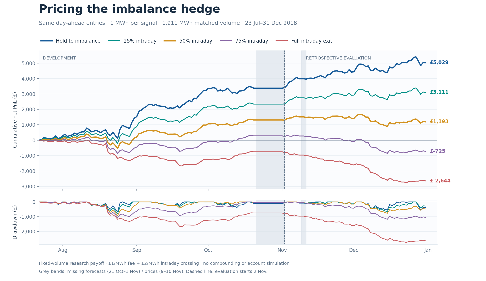
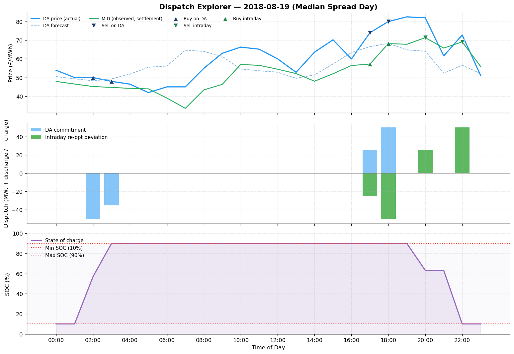

# Day-Ahead Power Trading

An end-to-end quantitative trading framework for the GB wholesale electricity
market: day-ahead virtual positioning against imbalance, hybrid intraday
execution, and battery dispatch optimised by LP with rolling-horizon
re-optimisation — validated on a 2018 backtest and benchmarked live against the
real GB battery fleet.




---

## Layout

```
src/          strategy machinery — LP dispatch, ML models, features, backtest
fleet/        the GB battery fleet: who exists, what they did
live/         live GB feeds, classification, settlement
dashboard/    two Streamlit apps: backtest replay, live benchmark
research/     the study — notebooks 01-10, robustness checks, the A0 poster
docs/         architecture, data sources, specs
scripts/      store builders and maintenance tooling
tests/        run in CI on every push
```

## Quick-start

```bash
conda create -n quantenv python=3.12 && conda activate quantenv
pip install -r requirements.txt

cp .env.example .env                          # add your ENTSO-E API key
cp configs/config.example.yaml configs/config.yaml

python bootstrap_data.py                      # seed sample data
make install-hooks                            # pre-commit hook, blocks CI-breaking commits
make check                                    # format, lint, type-check, test
python main.py --config configs/config.yaml   # run the pipeline
```

```bash
python main.py --config configs/config.yaml --mode bess   # battery strategy
python main.py --config configs/config.yaml --mode all    # both, sequentially
make dashboard                                            # backtest replay
streamlit run dashboard/live_app.py                       # live GB benchmark
make poster                                               # compile the A0 board
```

---

## The strategies

**Virtual** — ML-proxied residual-load mispricing against the EPEX day-ahead
auction. Features pinned to the D-1 10:30 pre-auction vintage; walk-forward
validation on sliding 200-day windows; exposure capped at the top-5
highest-conviction periods per direction per day. Intraday execution splits
volume between a passive MID hedge (15%, selected in notebook 02) and an active
TP/SL engine, with imbalance as the deliberate terminal fallback rather than an
unavoidable residual.

**BESS** — Day-ahead schedule solved by LP (PuLP/HiGHS) against an ML price
forecast, settling against the actual cleared price, so forecast quality drives
PnL. Degradation is priced into the objective, not deducted afterwards. SOC
carries across days. The intraday stage walks the day period by period: the
current settlement period is priced at its **observed** MID, the still-unseen
future at a hurdled DA proxy, and only the visible period is executed and locked
before rolling forward — so new information genuinely arrives at each step and
the day settles at ≈ 0 imbalance.

The **market-allocation lever** (`da_commit_fraction`) partitions both power and
the daily cycle budget between the auction and the intraday stage. Partitioning
energy as well as power is what makes the reservation real; notebook 03 sweeps
the frontier to find what the optimal constant split would have been.

**Backtest results are upper-bound estimates on a single 2018 window.** Notebook
01 §3, §5 and §6 carry the hyperparameter-stability check, drawdown context and
the naive-baseline decomposition that separates model skill from imbalance carry.

→ Commercial model, asset state machine and PnL decomposition in
[docs/ARCHITECTURE.md](docs/ARCHITECTURE.md#5-phase-3-physical-asset-bess-optimisation).

---

## Dashboards

The pipeline reports aggregate PnL, which tells you how much the battery made
but not why it acted as it did. Two Streamlit apps close that gap.

**Backtest replay** (`dashboard/app.py`) faithfully replays the strategy the
pipeline runs and exposes the per-hour decision trail — why it charged or
discharged in each settlement period, how SOC evolved, where the forecast misled
it, where it hit limits. A model-debugging tool, not a trading interface.

**Live GB benchmark** (`dashboard/live_app.py`) runs the same engine on current
market data, settling three reference batteries (50 MW at 1h/2h/4h) against
actual day-ahead and intraday prices. Day-ahead from Nord Pool (N2EX), intraday
MID, generation and demand from Elexon — both public, **no API key**. Pages are
grouped by epistemic status: the simulated benchmark, the observed GB system, and
the research layer, plus a methodology page carrying scope and caveats.

→ Deploy steps and structure in [docs/DEVELOPMENT.md](docs/DEVELOPMENT.md#dashboard).

---

## Research

The framework is also the instrument for a study of the GB battery fleet: does
profit-optimal dispatch coincide with what a resilient system needs, and what
would closing the gap cost?

Ten notebooks. Five carry the argument, and each one interrogates the last.

| | | |
|---|---|---|
| **04** | Alignment gap | Poses the question against a modelled battery, on a priced benchmark |
| **05** | Stress response | Takes it to the real fleet, on the operator's own scarcity instruments rather than a price proxy |
| **07** | Regime shift | **Attacks 05.** Rising response, or a step change at the Open Balancing Platform cutover? |
| **09** | Model vs fleet | **Concedes 04 and 05 were never comparable** — two rulers, two questions — and rebuilds them onto one |
| **10** | Acceptances | **Corrects 05, 08 and 09.** A notification is a plan; the Balancing Mechanism instructs units away from it |

The finding: energy prices already secure most of a modelled battery's high-load
alignment, and what stays unpriced is readiness for scarcity.

The census behind the denominators (06), the modern-era re-cut (08), the strategy
backtests (01–03), the robustness checks and the A0 board:
**[research/](research/)**

---

## Docs

| | |
|---|---|
| [docs/ARCHITECTURE.md](docs/ARCHITECTURE.md) | Strategy design, market rationale, signal logic, BESS commercial model |
| [docs/DATA_SOURCES.md](docs/DATA_SOURCES.md) | Seven datasets across three APIs, CSV fallbacks, per-day caching |
| [docs/DATA_ARCHITECTURE.md](docs/DATA_ARCHITECTURE.md) | The two tiers — notebooks as the full research instrument, the dashboard as a light presentation surface — and how the battery census is built |
| [docs/DEVELOPMENT.md](docs/DEVELOPMENT.md) | Environment, config reference, project structure, dashboards, VS Code launch configs |
| [research/README.md](research/README.md) | The study: what each notebook asks, and why they are read in order |

---

## Roadmap

- [x] **Phase 1 — DA positioning engine.** Walk-forward validated XGBoost on residual-load mispricing, with signal gating, execution constraints and dynamic sizing.
- [x] **Phase 2 — Intraday execution.** Hybrid passive-MID / active-TP-SL engine with configurable hedge ratio and per-period stop-loss cap.
- [ ] **Phase 3 — Physical asset optimisation (in progress).** LP day-ahead scheduling plus rolling-horizon intraday re-optimisation, SOC tracking, asymmetric efficiencies, priced degradation, and the market-allocation lever. Validated against the live GB benchmark and the real fleet.
- [ ] **Phase 4 — Stochastic optimisation and MID forecasting (planned).** Replace the constant `da_commit_fraction` with a two-stage scenario LP; replace the DA-price proxy for unseen periods with a genuine updating MID forecast; then reformulate the replan as a multi-stage stochastic programme, producing dispatch robust to forecast error rather than point-optimal against a single forecast.

---

## Data

- **[Nord Pool data portal](https://data.nordpoolgroup.com)** — GB (N2EX) day-ahead prices for the live benchmark (recent ~60 days, no key)
- **[ENTSO-E Transparency Platform](https://transparency.entsoe.eu)** — GB day-ahead prices for the historical backtest
- **[Elexon BMRS](https://bmrs.elexon.co.uk)** — physical notifications, balancing acceptances, declared limits, LoLP and de-rated margin
- **[NESO data portal](https://www.neso.energy/data-portal)** — Capacity Market notices and registers

Licensed under [MIT](LICENSE).
